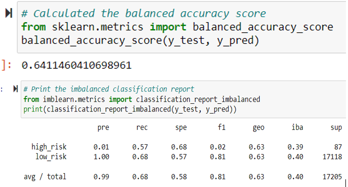

# Credit_Risk_Analysis using Machine Learning
Credit risk is an inherently unbalanced classification problem, as good loans easily outnumber risky loans. This project predicts credit risk, different techniques to train and evaluate models with unbalanced classes.
## Overview of the analysis:
Purpose of this project is to use the credit card credit dataset from LendingClub trying different techniques to predict credit risk and make recommendations on the techniques.
Six different models are used; oversample the data using the RandomOverSampler and SMOTE algorithms and undersample the data using the ClusterCentroids algorithm, combinatorial approach of over- and undersampling using the SMOTEENN algorithm, two new machine learning models that reduce bias, BalancedRandomForestClassifier and EasyEnsembleClassifier. 
Two jupyter notebooks files are submitted. One file has the code for the resampling models and SMOTEENN  the second file has the code for the ensemble classifiers to predict credit risk.
#### Tools:
Using Python, Jupyter Notebooks, imbalanced-learn and scikit-learn libraries.
## Results:
Six types of supervised machine learning models on credit card loan data is analysed to predict the credit risk. The following lists, describes the balanced accuracy scores and the precision and recall scores of all six machine learning models using screenshots of outputs to support the results.

Two oversampling methods 'naive random oversampling' and 'smote' oversampling are used. Cluster Centroids model is an undersampling tecnique and combination (over and under) sampling uses the 'smoteen' algorithm. All of the four models I mentioned which are oversampling, undersampling and combination models based on resampling techniques designed to deal with class imbalance. Oversampling, undersampling and combination approaches all adress class imbalance. In the case of credit risk analysis good loans class is much higher than the risky loans and this is why we deal with many more good loans than risky loans. This is the class imbalance in resampling techniques which refers to a situation in which the existing classes in a dataset aren't equally represented. 

Last two models 'balanced random forest' and 'easy ensemble adaboost' are ensemble learning. The concept of ensemble learning is the process of combining multiple models, like decision tree algorithms, to help improve the accuracy and robustness, as well as decrease variance of the model, and therefore increase the overall performance of the model.

- Naive Random Oversampling:
Oversampling addresses class imbalance by duplicating or mimicking existing data. In random oversampling, instances of the minority class are randomly selected and added to the training set until the majority and minority classes are balanced. Next, the dataset is split into training and testing sets, then randomly oversampled the minority class with the imblearn library. 
The following image examines the classification report to assess the results. While precision ("pre" column) is low for the high_risk class, precision is high for the low_risk class. Recall ("rec" column) are for high and low risk are 0.57 and 0.68.  
 - Accuracy score: 0.64
 - Precision: high risk: 0.01 and low risk: 1.00
 - Recall: high risk: 0.57 and low risk: 0.68
 - F1: high risk: 0.02 and low risk: 0.81

- SMOTE Oversampling:
The synthetic minority oversampling technique (SMOTE) is another oversampling approach to deal with unbalanced datasets. In SMOTE, like random oversampling, the size of the minority is increased. In SMOTE, by contrast, new instances are interpolated. That is, for an instance from the minority class, a number of its closest neighbors is chosen. Based on the values of these neighbors, new values are created. The following image examines the classification report to assess the results.

The metrics of the minority class (precision, recall, and F1 score) are slightly lower over those of random oversampling.
 - Accuracy score: 0.627
 - Precision: high risk: 0.01 and low risk: 1.00
 - Recall: high risk: 0.62 and low risk: 0.63
 - F1: high risk: 0.02 and low risk: 0.78

- Undersampling - Cluster Centroids:
In oversampling, the smaller class is resampled to make it larger. Undersampling takes the opposite approach of oversampling. Instead of increasing the number of the minority class, the size of the majority class is decreased. Undersampling only uses actual data. On the other hand, undersampling involves loss of data from the majority class. Furthermore, undersampling is practical only when there is enough data in the training set.
The algorithm identifies clusters of the majority class, then generates synthetic data points, called centroids, that are representative of the clusters. The majority class is then undersampled down to the size of the minority class. The metrics of the minority class (precision, recall, and F1 score) are lower over those of oversampling.
 - Accuracy score: 0.627
 - Precision: high risk: 0.01 and low risk: 1.00
 - Recall: high risk: 0.59 and low risk: 0.43
 - F1: high risk: 0.01 and low risk: 0.60

- Combination (Over and Under) Sampling - with SMOTEENN: 
An approach to resampling that combines aspects of both oversampling and undersampling. SMOTEENN is a two-step process: One is: Oversample the minority class with SMOTE. Second is: Clean the resulting data with an undersampling strategy. If the two nearest neighbors of a data point belong to two different classes, that data point is dropped.
The pre and rec results show an improvement over undersampling. F1 and recall values improved with over and under combination sampling model.
 - Accuracy score: 0.51
 - Precision: high risk: 0.01 and low risk: 1.00
 - Recall: high risk: 0.70 and low risk: 0.58
 - F1: high risk: 0.02 and low risk: 0.73

- Balanced Random Forest Classifier:
Random forest algorithm will sample the data and build several smaller, simpler decision trees. Each tree is simpler because it is built from a random subset of features. The pre and rec results show an improvement over resampling models for the risky loan.
   - Accuracy score: 0.78
   - Precision: high risk: 0.04 and low risk: 1.00
   - Recall: high risk: 0.67 and low risk: 0.91
   - F1: high risk: 0.07 and low risk: 0.95

- Easy Ensemble AdaBoost Classifier:
The idea behind Adaptive Boosting In AdaBoost, a model is trained then evaluated. After evaluating the errors of the first model, another model is trained. This time, however, the model gives extra weight to the errors from the previous model. This process is repeated until the error rate is minimized. The pre and rec results show an improvement over balanced random forest classifier and resampling models.
   - Accuracy score: 0.92
   - Precision: high risk: 0.07 and low risk: 1.00
   - Recall: high risk: 0.91 and low risk: 0.94
   - F1: high risk: 0.14 and low risk: 0.97

## Summary:
Credit risk is an inherently unbalanced classification problem, as good loans easily outnumber risky loans. Therefore, different techniques are used to train and evaluate models with unbalanced classes using imbalanced-learn and scikit-learn libraries to build and evaluate models using resampling.
In summary, this project using the credit card credit dataset from LendingClub, oversamples the data using the RandomOverSampler and SMOTE algorithms, and undersample the data using the ClusterCentroids algorithm. Also uses a combinatorial approach of over- and undersampling using the SMOTEENN algorithm. Lastly, I compare two new machine learning models that reduce bias, BalancedRandomForestClassifier and EasyEnsembleClassifier, to predict credit risk. 

#### Evaluation of the performance of the used models:
 I've created the Machine Learning training and target variables as seen in the images above as an output of the classification reports.

Accuracy score for the ensemble classifier models, namely BalancedRandomForestClassifier and EasyEnsembleClassifier are the highest 0.78 and 0.92. For the first four resampling models accuracy score is ranging between 0.51 to 0.64. According to the accuracy score ensemble models has much higher predictions that the ensemble model is accurate. But it is alone not enough to make a decision and need to look at the other results of the classification report.

Precision for the first resampling models are the same; for high risk loans is 0.01 and low-risk loans is 1. As for the  is the BalancedRandomForestClassifier and EasyEnsembleClassifier high-risk precision is 0.04 and 0.07 respectively. Precision is a measure of how reliable a positive classification is. A low precision is indicative of a large number of false positives meaning low-risk loans were identified as high-risk loans. Resampling models indicates lower false positives. Ensemble models scored higher results in precision which indicates an unreliable positive classification.

Recall for high-risk loans for the resampling is between 0.57 and 0.70 and low-risk resampling model is between 0.43-0.68. For the BalancedRandomForestClassifier recall for high-risk is 0.67 and low-risk 0.91. As for EasyEnsembleClassifier model recall for high and low risk loans are over 0.90. Recall is the ability of the classifier to find all the positive samples. A low recall is indicative of a large number of false negatives meaning not too many high risk loans were marked as low risk loans.

F1 score for the resampling models the first four, is between 0.01-0.02 for the high-risk loans and 0.60 to 0.81 for the low-risk loans. 
As for the BalancedRandomForestClassifier and EasyEnsembleClassifier models high-risk and low-risk loan F1 values are higher, especially for the low-risk loans over 0.95. F1 score is a weighted average of the true positive rate (recall) and precision, where the best score is 1.0 and the worst is 0.0.

In summary, resampling models resulted in lower accuracy and F1 scores which shows that it is not very efficient in classifying fradualent loan applications. We may need more data, more cleaning, another model parameter, or a different model. The ensemble method use a process to minimize the errors as much as possible or until a specified number of repetitions has been reached. 
The last two models use a learning rate and adjust the rate upward. The results show that it is a powerful technique with the highest accuracy and F1 scores.

